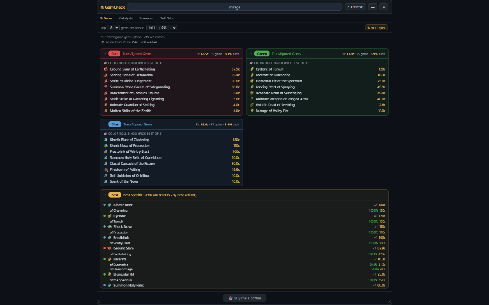

# GemCheck – PoE Transfigured Gem Calculator

[](https://buymeacoffee.com/lebedevsd)

A Chrome extension that overlays a floating panel on [poe.ninja](https://poe.ninja) and calculates which transfigured gems are most profitable to farm at the **Labyrinth Divine Font** in Path of Exile.



---

## How the Divine Font works

The Divine Font offers two ways to transfigure a gem:

- **Color Roll** — insert any gem of a colour and receive a random transfigured gem from that colour's entire pool (equal chance for each gem in the pool).
- **Specific Roll** — insert a specific base gem and receive one of that gem's transfigured variants at random (equal chance per variant).

GemCheck calculates the **expected value (EV)** and **hit probabilities** for both modes using live poe.ninja pricing so you can make informed decisions before running the lab.

---

## Features

- **Color Roll Bingo** — for each colour (Red / Green / Blue) shows the top target gems with pool EV, hit probability per gem, and current sell price.
- **Best Specific Gems** — a combined cross-colour ranking of all base gems sorted by EV, with every variant's probability and sell price listed.
- **Live pricing** — pulls directly from poe.ninja's public API for the current league. Data is cached for 5 minutes; a Refresh button busts the cache.
- **League auto-detection** — reads the league from the poe.ninja URL automatically.
- **Draggable panel** — reposition anywhere on screen; minimise or close when not needed.
- **Configurable Top N** — choose how many gems to show per section (3 / 5 / 8).

> Prices shown are raw sell prices (cheapest non-corrupted listing on poe.ninja).
> Base gem cost and lab fees are not deducted.

---

## Installation

### From the Chrome Web Store *(recommended)*
Coming soon.

### Manual (Developer Mode)
1. Download or clone this repository.
2. Open Chrome and go to `chrome://extensions`.
3. Enable **Developer mode** (top-right toggle).
4. Click **Load unpacked** and select the repository folder.
5. Navigate to `poe.ninja › Economy › [your league] › Skill Gems` — the panel appears automatically.

---

## Usage

1. Go to **poe.ninja** and open the Skill Gems page for your league.
2. The GemCheck panel appears in the top-right corner.
3. Use the **Top N** selector to control how many gems are shown.
4. Click **Refresh** to fetch the latest prices.
5. Drag the panel anywhere on screen; click **—** to minimise or **✕** to close.

---

## Development

### Prerequisites
- Python 3 (stdlib only, no pip required)
- make (optional, all commands have Python equivalents)

### Workflow

```bash
make fetch      # pull latest gem data from poewiki
make update     # rewrite gem arrays in content.js from fetched JSONs
make pack       # build gemcheck.zip ready for the Chrome Web Store
make release    # all three in one shot (new league? run this)
make screenshot # generate assets/screenshot_store.png from newest PNG in root
make version    # print current version
make clean      # remove gemcheck.zip
```

`make screenshot` auto-detects the newest `brave_*.png` or `Screenshot*.png` in the project root. To use a specific file:

```bash
make screenshot SRC=path/to/file.png
```

### Loading in Chrome for testing

1. Open `chrome://extensions`
2. Enable **Developer mode** (top-right toggle)
3. Click **Load unpacked** → select this folder
4. Make changes to `content.js`, then click **↻** in `chrome://extensions` to reload

### Updating gem data (new league)

```bash
make release
```

This scrapes poewiki for the latest base gem and transfigured gem lists, updates the static arrays in `content.js`, and rebuilds the zip.

---

## Data sources

- **Gem prices** — [poe.ninja](https://poe.ninja) public API (`/api/data/itemoverview?type=SkillGem`)
- **Gem colour data** — [poewiki.net/wiki/List_of_skill_gems](https://www.poewiki.net/wiki/List_of_skill_gems)

---

## Privacy

GemCheck collects no user data. See [PrivacyPolicy.md](PrivacyPolicy.md) for full details.

---

## Licence

[MIT](LICENSE)

