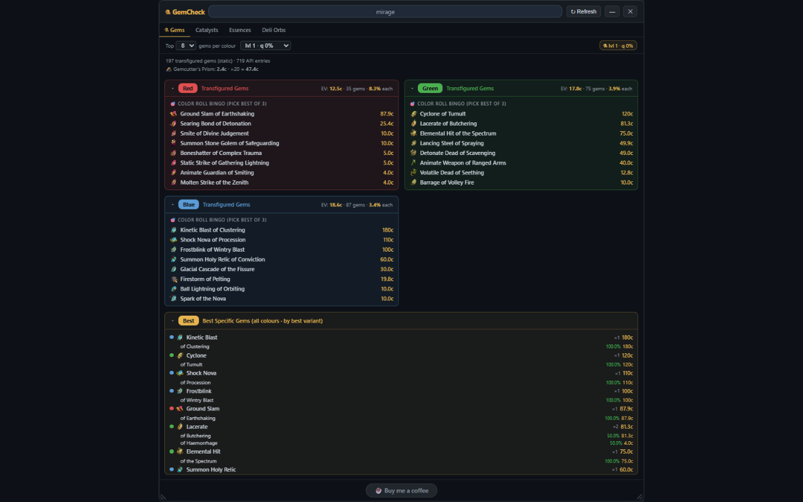

# GemCheck – PoE Transfigured Gem Calculator

[](https://buymeacoffee.com/lebedevsd)

A browser extension that overlays a floating panel on [poe.ninja](https://poe.ninja) and helps you make profitable decisions at several endgame crafting mechanics in Path of Exile:

- **Labyrinth Divine Font** — which transfigured gems to hunt
- **Harvest crafting** — whether to swap Catalysts, Essences, Delirium Orbs, or Astrolabes for profit
- **Forbidden Jewels** — average market price of Forbidden Flame and Forbidden Flesh variants in divines



---

## How the Divine Font works

The Divine Font offers two ways to transfigure a gem:

- **Color Roll** — insert any gem of a colour and receive a random transfigured gem from that colour's entire pool (equal chance for each gem in the pool).
- **Specific Roll** — insert a specific base gem and receive one of that gem's transfigured variants at random (equal chance per variant).

GemCheck calculates the **expected value (EV)** and **hit probabilities** for both modes using live poe.ninja pricing so you can make informed decisions before running the lab.

## How Harvest Swap works

The Harvest crafting bench lets you **swap** a currency item (Catalyst, Essence, or Delirium Orb) for a random item of the same type. The swap costs Crystallised Lifeforce.

GemCheck shows:
- **Pool EV** — the weighted average sell price across all possible outcomes
- **Craft threshold** — pool EV minus craft cost; items priced below this are worth sacrificing for a reroll
- **▲ keep / ▼ craft** — per-item indicators showing whether to hold or swap

Drop probabilities for Catalysts and Delirium Orbs are based on ~2000 observed swaps by [lifewithoutpants_](https://www.youtube.com/@lifewithoutpants_) (YouTube).

---

## Features

### Divine Font (Skill Gems page)
- **Color Roll Bingo** — for each colour (Red / Green / Blue) shows the top target gems with pool EV, hit probability per gem, and current sell price.
- **Best Specific Gems** — a combined cross-colour ranking of all base gems sorted by EV, with every variant's probability and sell price listed.
- **Configurable Top N** — choose how many gems to show per section (3 / 5 / 8).
- **Level/quality filter** — switch between lvl 1 q 0%, lvl 1 q 20%, lvl 20 q 0%, and lvl 20 q 20% to compare prices across gem states.

### Harvest Swap (Currency / Essences / Delirium Orbs / Astrolabes pages)
- **Catalysts** — weighted EV with observed drop probabilities; excludes Dextral, Sinistral, and Tainted Catalysts (different mechanic).
- **Essences** — EV for Deafening Essence swaps.
- **Delirium Orbs** — weighted EV with observed drop probabilities.
- **Astrolabes** — EV for Astrolabe swaps (400 Primal Lifeforce per swap).
- **▲ keep / ▼ craft indicators** — tells you at a glance which items are worth sacrificing.

### Forbidden Jewels (Forbidden Jewels page)
- **Avg price in divines** for Forbidden Flame and Forbidden Flesh across all passive variants.
- **Two rows**: all variants, and excluding 7 hidden ascendancy passives unavailable in-game.
- **Columns**: avg · σ (standard deviation) · min · max.

### General
- **Live pricing** — pulls directly from poe.ninja's public API for the current league. Data is cached for 5 minutes; a Refresh button busts the cache.
- **League auto-detection** — reads the league from the poe.ninja URL automatically.
- **Draggable panel** — reposition anywhere on screen; minimise or close when not needed.

> Prices shown are raw sell prices (cheapest listing on poe.ninja). Craft cost uses live Crystallised Lifeforce prices. Base gem cost and lab fees are not deducted.

---

## Installation

### From the Chrome Web Store *(recommended)*
[Install GemCheck on the Chrome Web Store](https://chromewebstore.google.com/detail/gemcheck-%E2%80%93-poe-transfigur/phmbbgjdehfchfeogoaboeinekkpfjpm)

### From Firefox Add-ons
[Install GemCheck on Firefox Add-ons](https://addons.mozilla.org/en-US/firefox/addon/gemcheck-poe-transfigured-gem/)

### From a GitHub Release — Chrome / Chromium
Works with any Chromium-based browser: **Chrome, Brave, Opera GX, Vivaldi, Edge**.

1. Go to the [Releases](../../releases) page and download `gemcheck.zip`.
2. Unzip it — you'll get a folder with `manifest.json`, `src/`, and `assets/`.
3. Open Chrome and go to `chrome://extensions`.
4. Enable **Developer mode** (top-right toggle).
5. Click **Load unpacked** and select the unzipped folder.
6. Navigate to `poe.ninja › Economy › [your league] › Skill Gems` — the panel appears automatically.

### From a GitHub Release — Firefox
1. Go to the [Releases](../../releases) page and download `gemcheck_firefox.zip`.
2. Open Firefox and go to `about:debugging` → **This Firefox**.
3. Click **Load Temporary Add-on** and select the zip directly (no need to unzip).
4. Navigate to `poe.ninja › Economy › [your league] › Skill Gems` — the panel appears automatically.

> **Note:** Temporary add-ons are removed when Firefox restarts. For a permanent install, the extension would need to be signed via [addons.mozilla.org](https://addons.mozilla.org).

---

## Usage

The panel appears automatically on the relevant poe.ninja pages.

**Divine Font (Skill Gems):**
1. Go to `poe.ninja › Economy › [your league] › Skill Gems`.
2. Use the **Top N** selector to control how many gems are shown per colour.

**Harvest Swap (Catalysts / Essences / Deli Orbs / Astrolabes):**
1. Go to `poe.ninja › Economy › [your league] › Currency` (Catalysts), `Essences`, `Delirium Orbs`, or `Astrolabes`.
2. Items marked **▲** are worth holding; items marked **▼** are worth sacrificing for a reroll.

**Forbidden Jewels:**
1. Go to `poe.ninja › Economy › [your league] › Forbidden Jewels`.
2. The panel shows avg, σ, min, max prices in divines for Forbidden Flame and Forbidden Flesh — with and without the 7 hidden ascendancy passives.

**General:**
- Click **Refresh** to fetch the latest prices.
- Drag the panel anywhere on screen; click **—** to minimise or **✕** to close.

---

## Development

### Prerequisites
- Python 3 (stdlib only, no pip required)
- make (optional, all commands have Python equivalents)

### Workflow

```bash
make fetch      # pull latest gem data from poewiki
make update     # rewrite gem arrays in content.js from fetched JSONs
make pack       # build gemcheck.zip ready for the Chrome Web Store
make release    # all three in one shot (new league? run this)
make screenshot # generate assets/screenshot_store.png from newest PNG in root
make version    # print current version
make clean      # remove gemcheck.zip
```

`make screenshot` auto-detects the newest `brave_*.png` or `Screenshot*.png` in the project root. To use a specific file:

```bash
make screenshot SRC=path/to/file.png
```

### Loading in Chrome for testing

1. Open `chrome://extensions`
2. Enable **Developer mode** (top-right toggle)
3. Click **Load unpacked** → select this folder
4. Make changes to `content.js`, then click **↻** in `chrome://extensions` to reload

### Updating gem data (new league)

```bash
make release
```

This scrapes poewiki for the latest base gem and transfigured gem lists, updates the static arrays in `content.js`, and rebuilds the zip.

---

## Data sources

- **Gem prices** — [poe.ninja](https://poe.ninja) public API (`/api/data/itemoverview?type=SkillGem`)
- **Gem colour data** — [poewiki.net/wiki/List_of_skill_gems](https://www.poewiki.net/wiki/List_of_skill_gems)
- **Catalyst / Deli Orb / Astrolabe prices** — poe.ninja exchange API (`/api/economy/exchange/current/overview`)
- **Essence prices** — poe.ninja item API (`/api/data/itemoverview`)
- **Forbidden Jewel prices** — poe.ninja stash API (`/poe1/api/economy/stash/current/item/overview?type=ForbiddenJewel`)
- **Catalyst & Deli Orb drop weights** — ~2000 observed swaps by [lifewithoutpants_](https://www.youtube.com/@lifewithoutpants_) (YouTube)

---

## Privacy

GemCheck collects no user data. See [PrivacyPolicy.md](PrivacyPolicy.md) for full details.

---

## Licence

[MIT](LICENSE)

